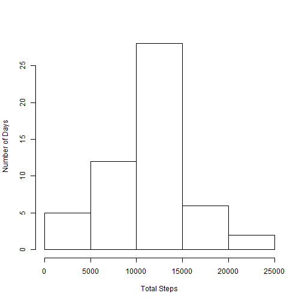
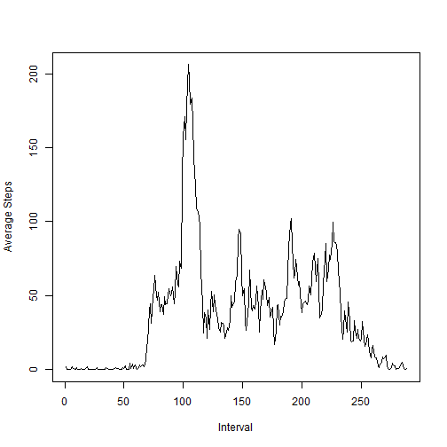
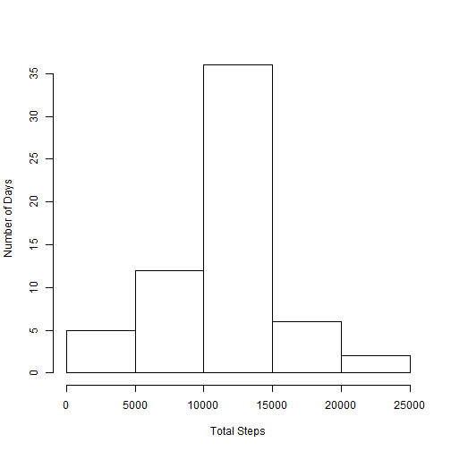
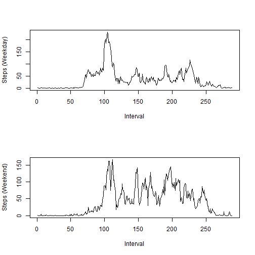

#Peer Assessment Assignment 1

##Loading and Preprocessing the Data

Read the data:


```r
data <- read.csv("./data/activity.csv")
```

##What is the mean total number of steps taken per day?

Calculate total steps taken each day:


```r
stepsByDate <- tapply(data$steps, data$date, sum)
```

Generate histogram of total steps taken by date:


```r
hist(stepsByDate, main = "", xlab = "Total Steps", ylab = "Number of Days")
```

 

Convert data to data frame, calculate and report mean:


```r
steps <- as.data.frame(stepsByDate)
mean <- mean(steps$stepsByDate, na.rm = TRUE)
mean
```

```
## [1] 10766.19
```

Calculate and report median:

```r
steps <- as.data.frame(stepsByDate)
median <- median(steps$stepsByDate, na.rm = TRUE)
median
```

```
## [1] 10765
```

##What is the average daily activity pattern?

Find average number of steps taken by interval:


```r
intervals <- as.data.frame(as.table((tapply(data$steps, data$interval, mean, na.rm = TRUE))))
names(intervals) <- c("interval", "steps")
```

##Plot average number of steps by interval


```r
plot(intervals$steps, type = "l", xlab = "Interval", ylab = "Average Steps")
```

 

##Find interval with the most steps


```r
library(dplyr)
```

```
## 
## Attaching package: 'dplyr'
## 
## The following object is masked from 'package:stats':
## 
##     filter
## 
## The following objects are masked from 'package:base':
## 
##     intersect, setdiff, setequal, union
```

```r
intervalsSorted <- arrange(intervals, desc(steps))
intervalsSorted[1,]
```

```
##   interval    steps
## 1      835 206.1698
```

The interval with the highest (average) steps is interval 835.

##Imputing missing values

Count NAs:


```r
sum(is.na(data$steps))
```

```
## [1] 2304
```

Replace NAs with average steps for that interval across all days:


```r
data2 <- merge(data, intervals, by.x = "interval", by.y = "interval")
data2 <- rename(data2, steps = steps.x, intervalAvg = steps.y)
for (i in 1:nrow(data2)) {
        if (is.na(data2[i,"steps"])) {
                data2[i, "steps"] <- data2[i, "intervalAvg"]
        }
}
```

Histogram, mean, and median using new data:

```r
stepsByDate2 <- tapply(data2$steps, data2$date, sum)
hist(stepsByDate2, main = "", xlab = "Total Steps", ylab = "Number of Days")
```

 

```r
steps <- as.data.frame(stepsByDate2)
summary(stepsByDate2)
```

```
##    Min. 1st Qu.  Median    Mean 3rd Qu.    Max. 
##      41    9819   10770   10770   12810   21190
```

The values differ when NAs are replaced with the average for that interval, but only slightly.

##Are there differences in activity patterns between weekdays and weekends?

Distinguish weekdays and weekends:


```r
data2 <- mutate(data2, realDate = as.Date(data2$date))
data2 <- mutate(data2, weekday = weekdays(realDate))
data2 <- mutate(data2, weekend = "")
for (i in 1:nrow(data2)) {
        if(data2[i,"weekday"] == "Saturday" | data2[i, "weekday"] == "Sunday") {
                data2[i, "weekend"] <- "weekend"
        } else {
                data2[i, "weekend"] <- "weekday"
        }
}
data2$weekend <- as.factor(data2$weekend)
intervals2 <- as.data.frame(tapply(data2$steps, list(data2$interval, data2$weekend), mean, na.rm = TRUE))
par(mfrow = c(2, 1))
plot(intervals2$weekday, type = "l", xlab = "Interval", ylab = "Steps (Weekday)")
plot(intervals2$weekend, type = "l", xlab = "Interval", ylab = "Steps (Weekend)")
```

 
